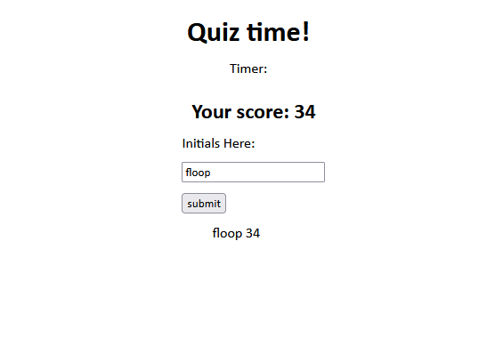

This was a ground up project to demonstrate my ability to edit what elements are on screen using JS and to store and pull things from local storage.

Link to deployed site: https://jaha675.github.io/Code-quiz/
Link to github repo: https://github.com/JaHa675/Code-quiz

It's a short quiz that doesn't really test your knowledge on anything, but does change dynamically when the wrong answer is selected, and moves along to the next question when correct.

It also stores previous highscores that have been submitted and displays them.

This project was pretty tough for me. I confused myself with similar variable names and spent a while fixing accidental shadowing problems. The skeleton of my JS was built pretty easily, but actually fleshing it out proved to be more difficult than I first hoped.